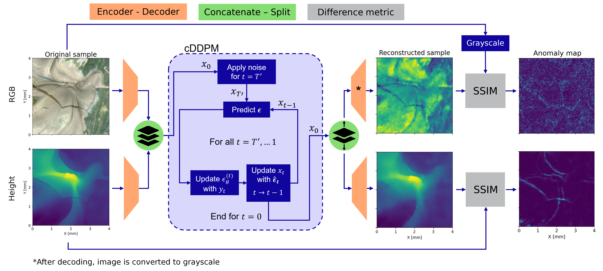

# Crack Detection in Paintings by Vincent van Gogh

This repository contains Python code for training and evaluating generative machine learning models to detect cracks in paintings by Vincent van Gogh.

## Table of Contents

- [Introduction](#introduction)
- [Installation](#installation)
- [Dataset](#dataset)
- [Models](#models)
- [Model Training](#model-training)
- [Evaluation](#evaluation)
- [Citation](#citation)
- [License](#license)
- [Acknowledgements](#acknowledgements)

## Introduction

This project aims to develop and evaluate generative machine learning models for detecting cracks in paintings by Vincent van Gogh. The models are trained on a dataset of high-resolution images of reproductions of Van Gogh's paintings, with the goal of identifying and highlighting cracks with lifted edges. More specifically, generative models are used for reconstruction-based out of distribution detection, therefore this repository features multiple generative models for that purpose.

This repository is forked from [HERE](https://github.com/ashleve/lightning-hydra-template), a convenient template for machine learning related experiments. Any documentation regarding training, validating and testing machine learning models, can be found in there. The READme of this repository is also included in the `docs` folder

<p align="center">
  
</p>

## Installation

To get started, clone this repository and install the required dependencies:

```bash
git clone https://github.com/levimohle/ml-crack-detection-van-gogh.git
cd ml-crack-detection-van-gogh
pip install -r requirements.yaml
```

## Dataset

The dataset contains RGB images and height maps of 512x512 px, from reproductions of Van Gogh paintings. Below some examples are included. 

<p align="center">
  
  
</p>

The patches are taken from 2 paintings made by Harm Belt, called _Almond Blossom_ and _Big Impasto_, shown below

<p align="center">
  
  
</p>

## Models

### Generative Models
#### DDPMs

- Vanilla DDPM [`paper`](https://arxiv.org/abs/2006.11239)
- DDIM [`paper`](https://arxiv.org/abs/2010.02502)
- conditioned DDPM [`paper`](https://arxiv.org/abs/2305.15956) | Proposed Method

#### Flow Matching

- Flow Matching [`paper`](https://arxiv.org/abs/2006.11239)
- guided Flow Matching [`paper`](https://arxiv.org/abs/2006.11239)

#### Normalizing Flows

-Vanilla Flow [`paper`](https://arxiv.org/abs/1505.05770)rea;
-RealNVP [`paper`](https://arxiv.org/abs/1605.08803)

### Deterministic Models
#### Convolutional Auto Encoder

- CAE

#### CNN classifier

- InceptionV4 [`paper`](https://arxiv.org/abs/1602.07261)

#### Deep Support Vector Data Description

- DeepSVDD [`paper`](https://proceedings.mlr.press/v80/ruff18a.html)


## Training

All model parameters are described in a `.yaml` file in the `configs\experiment`, which can be specified when running the PyTorch Lightning template. See `docs/README_LightningHydraTemplate.md` for more specific training commands/features of this template.

```bash
# Example command to train the model with 2 GPUs
python train.py experiment=impasto_cddpm_final trainer=ddp trainer.devices=2

# Example command to evaluate the model on single GPU
python eval.py +experiment=impasto_cddpm_final trainer=gpu ckpt_path=/best_model.ckpt
```

## Evaluation

## Acknowledgements

The [`GenerativeZoo`](https://github.com/caetas/GenerativeZoo) repository has a great collection of generative models and has been used as a basis for building my own generative models. Please make sure to visit this repository if you are in need of generative models.

## Citation
If you publish work that uses the work presented in this repository, please cite ml-crack-detection-van-gogh as follows:

```bibtex
@misc{ml-crack-detection-van-gogh,
author = {Levi Möhle},
title = {Reconstruction-based out of distribution detection for paintings by Vincent van Gogh},
publisher = {GitHub},
journal = {GitHub repository},
howpublished = {\url{https://github.com/levimohle/ml-crack-detection-van-gogh}},
year = {2025},
}
```

For citing the paper, please cite as follows:

```bibtex
@misc{crackdetectionvg_2025,
author = {L.S. Möhle},
title = {Crack detection in paintings by Vincent van Gogh},
publisher = {Eindhoven University of Technology},
journal = {Research portal Eindhoven University of Technology},
howpublished = {\url{}},
year = {2025},
}
```
## License

MIT License

Copyright (c) [2025] [Levi Möhle]

Permission is hereby granted, free of charge, to any person obtaining a copy
of this software and associated documentation files (the "Software"), to deal
in the Software without restriction, including without limitation the rights
to use, copy, modify, merge, publish, distribute, sublicense, and/or sell
copies of the Software, and to permit persons to whom the Software is
furnished to do so, subject to the following conditions:

The above copyright notice and this permission notice shall be included in all
copies or substantial portions of the Software.

THE SOFTWARE IS PROVIDED "AS IS", WITHOUT WARRANTY OF ANY KIND, EXPRESS OR
IMPLIED, INCLUDING BUT NOT LIMITED TO THE WARRANTIES OF MERCHANTABILITY,
FITNESS FOR A PARTICULAR PURPOSE AND NONINFRINGEMENT. IN NO EVENT SHALL THE
AUTHORS OR COPYRIGHT HOLDERS BE LIABLE FOR ANY CLAIM, DAMAGES OR OTHER
LIABILITY, WHETHER IN AN ACTION OF CONTRACT, TORT OR OTHERWISE, ARISING FROM,
OUT OF OR IN CONNECTION WITH THE SOFTWARE OR THE USE OR OTHER DEALINGS IN THE
SOFTWARE.
